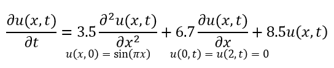
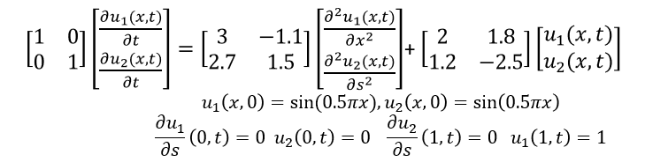
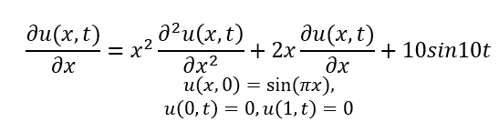
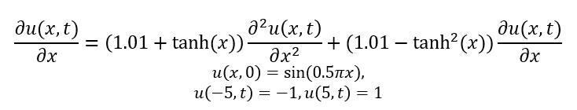

# Inplementation

## Environment
```
python == 3.10.4
```

## Strcture

The file 3parafixation.py is used to eatimation the constant number parameters.

The file fixation_mo.py is used to eatimation the constant matrix parameters.

The file fixation_sd.py is used to eatimation the parameters with spatial dependency.

The file fixation_sdmo.py is used to eatimation the matrix parameters with spatial dependency.

The file dataprecessing.py is used to preprocess the data, resize the data, transform the data to tensor and make the validation set.

The file draw.py is used to save the eatimation results using the trained model.

The file test_sd.py is used to visualize the function parameters estimation results.

## File 

In dataset, there has some example datasets.

In model, there has some trained model to test.

In MATLAB, there is the code of pde solver for single number or matrix parameters.

## Example

Here are the example model for test each netwrok. The coresponding dataset is in the file dataset. And the visualization results are in the file results. The trained models are in the file model. 

single number parameters



matrix parameters



function parameters example 1



function parameters example 2

