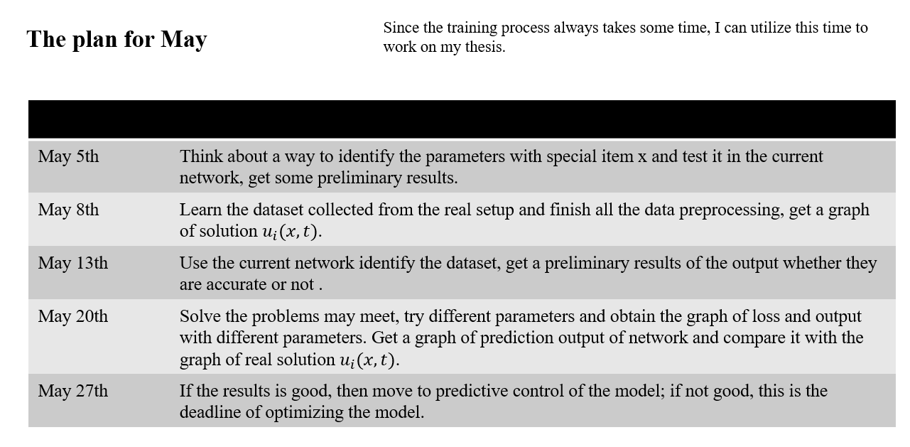

# Plan of May

## May 2nd,2024

1. The MATLAB function used for generating datasets can only solve PDEs with second derivatives and the solution \( u \). When we add the first derivative to the PDE, the dataset becomes inaccurate, leading to inaccurate results from the network.

2. In a PDE with two diagonal matrix parameters \( \alpha \) and \( \gamma \) of size 2*2, the network can find the parameters when \( \gamma[2][2]\) equals zero. However, the approximate solution \( \hat{u} \) from the network appears to be the same as the true solution (refer to the file "results"). I believe it might be worth trying least squares to find the parameters.

3. Currently, I haven't found a suitable toolbox to solve PDEs with full matrix parameters, making it difficult to generate datasets. However, datasets can be generated with special items \( x \) in the matrix. I will attempt to solve this in the next step.